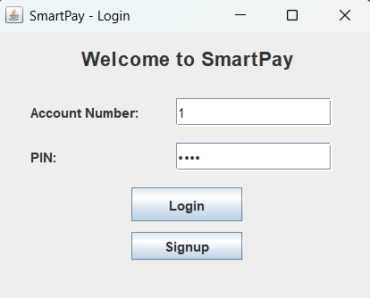
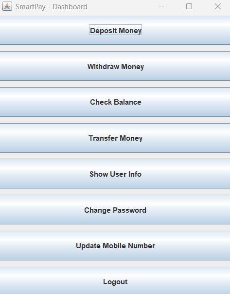
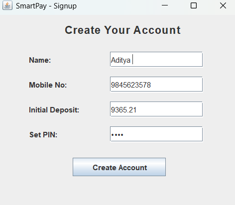
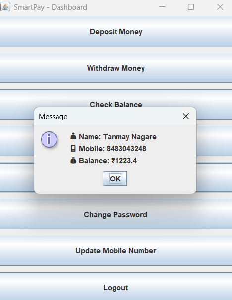

# 💳 SmartPay - Java Desktop Fintech Application

**SmartPay** is a desktop-based fintech application built with Java Swing and MySQL. It simulates basic banking operations like account creation, login, money transfer, deposits, withdrawals, and mobile/PIN management.

---

## 🚀 Features

- 🧾 Create account with mobile number and 4-digit PIN
- 🔐 Secure login (account number + PIN)
- 💰 Deposit & Withdraw money
- 🔄 Transfer money between users
- 📊 Check balance
- 👤 View account info (PIN protected)
- 🔄 Change or reset PIN using mobile number
- 📱 Update mobile number
- 🖥️ Java Swing GUI
- 🗃️ MySQL backend
- 🖱️ .exe build support

---

## 🧱 Tech Stack

| Layer        | Technology             |
|--------------|------------------------|
| Language     | Java (JDK 24)          |
| UI Framework | Java Swing             |
| Database     | MySQL 8+               |
| Connector    | JDBC (MySQL Connector) |
| Packaging    | Launch4j (.exe Maker)  |
| IDE          | Eclipse / IntelliJ     |

---

## 🔧 Setup Instructions

### 1️⃣ Clone or Download Project

git clone https://github.com/your-username/SmartPay.git
cd SmartPay

### 2️⃣ Create MySQL Database

CREATE DATABASE SmartPay;

USE SmartPay;

CREATE TABLE users (
  accountNumber INT PRIMARY KEY AUTO_INCREMENT,
  name VARCHAR(100),
  pin INT,
  balance DOUBLE
  mobile VARCHAR(10),
  
);

### 3️⃣ Configure JDBC Connection

String url = "jdbc:mysql://localhost:3306/SmartPay";
String user = "root";
String password = "";

💡 Replace with your local MySQL credentials.

### 4️⃣ Run the App

Open the project in Eclipse or IntelliJ

Run LoginScreen.java (GUI will launch)

Click "Sign Up" to register

Login and access dashboard features

### 📸 Screenshots

### 🔐 Login Screen

### 🧾 Dashboard Screen

### 🔐 SignUp Screen

### 🔐 User Info

### 🙋 Author
Made by [Niketan Sarode]
📧 nniketan04@gmail.com

